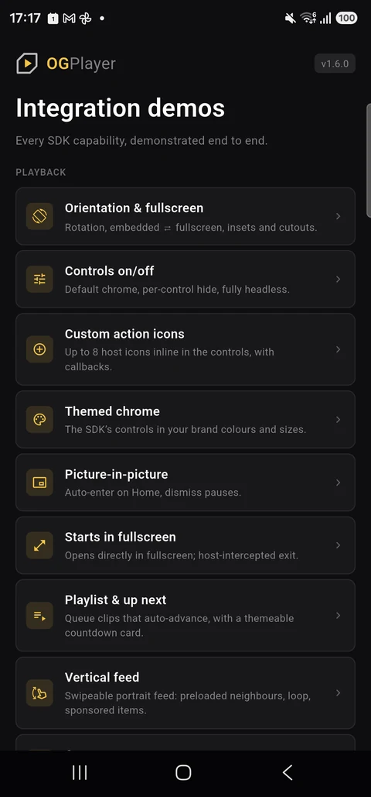
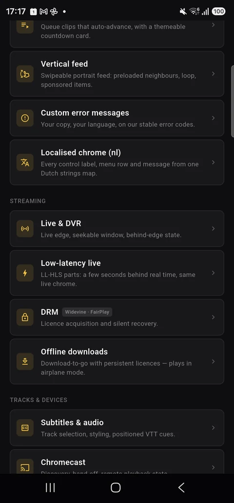
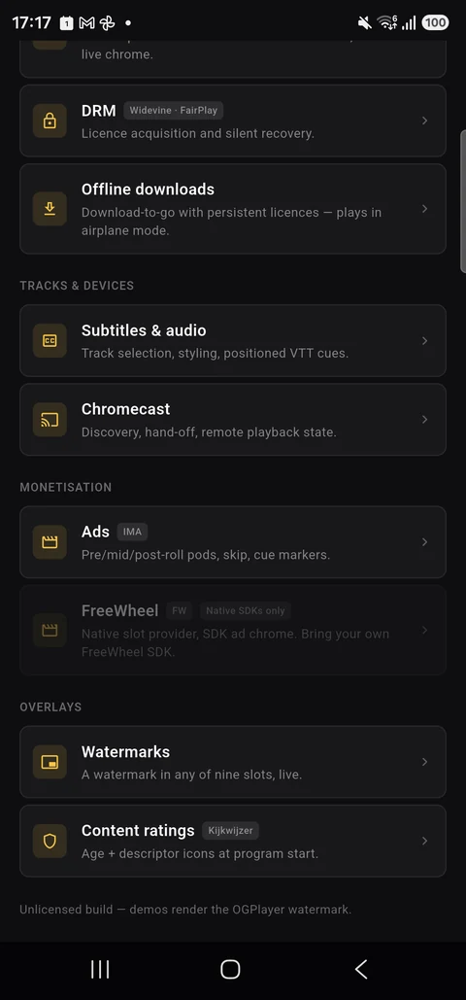
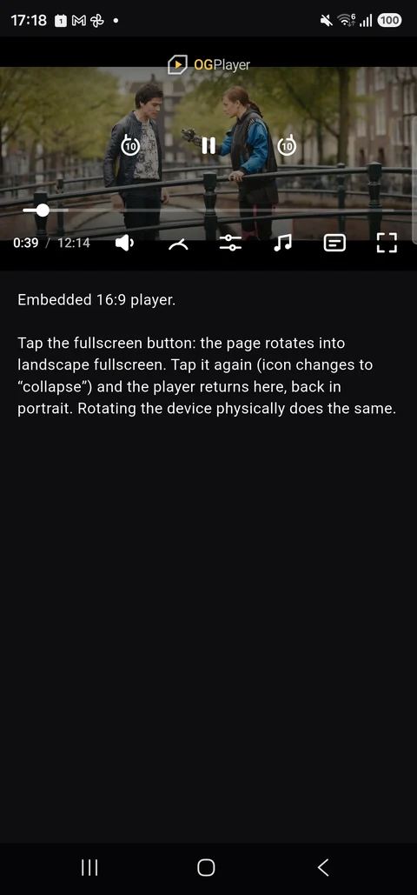
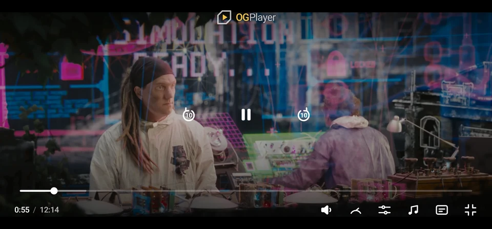
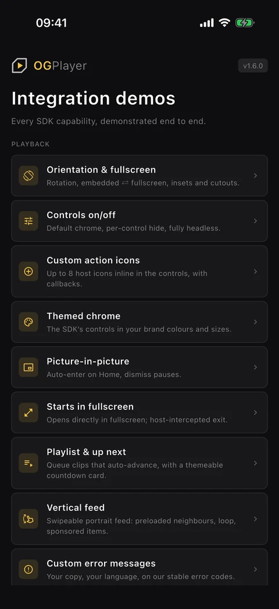
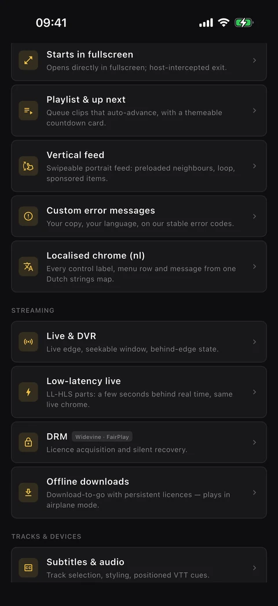
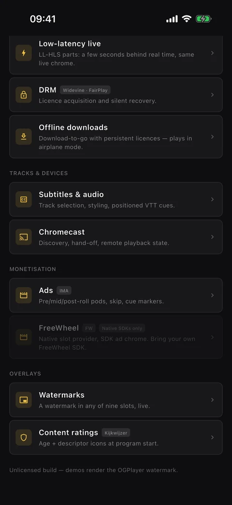
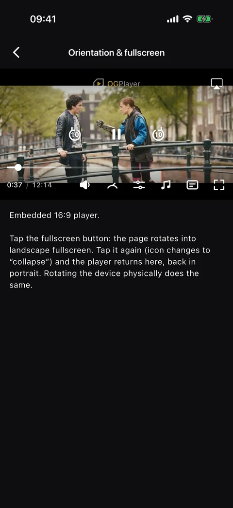
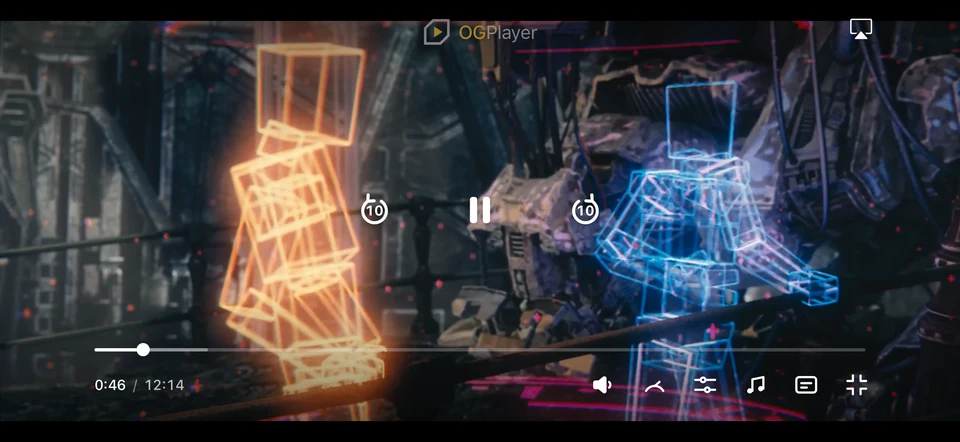

# OGPlayer — Flutter demo app

Integration demos for the [OGPlayer](https://ogplayer.tv) Flutter SDK
([`ogplayer_flutter`](https://pub.dev/packages/ogplayer_flutter) on pub.dev):
VOD, live & DVR, low-latency live (LL-HLS, a few seconds behind real time),
DRM with a Dart token provider, Google IMA ads, playlists with an "Up next"
card, a swipeable vertical video feed, subtitles & multi-audio, offline
downloads, picture-in-picture, casting, content ratings, watermark overlays,
custom controls, themed chrome (your brand's colour and size tokens),
localised chrome (every control label, menu row and message from one
strings map) and error handling — each demo is a small, readable screen you
can lift code from.

## Screenshots

Android:

<p>
  
  
  
</p>
<p>
  
  
</p>

iOS:

<p>
  
  
  
</p>
<p>
  
  
</p>

## Run it

```bash
flutter pub get

# Android — device or emulator
flutter run

# iOS — device (FairPlay and downloads need real hardware)
flutter run -d <device-id>
```

Requires Flutter 3.29+. The SDK resolves from pub.dev:

```bash
flutter pub add ogplayer_flutter
```

## Integrating in your own app

The demo already carries the platform requirements your app will need too:

- **Android** — `minSdk 26`, core-library desugaring (the playback engine
  requires it), a `FlutterFragmentActivity` host, and — only if you enable
  casting — the `OGCastOptionsProvider` meta-data entry in
  `AndroidManifest.xml`.
- **iOS** — iOS 18+. `AppDelegate` forwards
  `supportedInterfaceOrientationsFor` to the plugin (fullscreen rotation)
  and `handleEventsForBackgroundURLSession` to the plugin's downloads hook
  (see `ios/Runner/AppDelegate.swift`).
- The demo list is portrait; every demo screen rotates so the player can
  go fullscreen. The vertical feed is a portrait surface.

Docs: https://ogplayer.tv/docs

## Notes

- **FreeWheel** ads are not yet available in the Flutter SDK — use the
  native Android/iOS SDKs if you need FreeWheel today.
- **Licensing:** this demo code is MIT. The OGPlayer SDK itself is a
  commercial product — free to evaluate with a watermark; production use
  requires a license. See https://ogplayer.tv/terms/
- **Read-only repository:** issues and pull requests are closed —
  questions and reports are welcome at hello@ogplayer.tv.

Demo content: Tears of Steel — (CC) Blender Foundation · mango.blender.org
